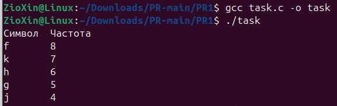

# ЗАВДАННЯ ЗА ВАРІАНТОМ

## Умова

Реалізуйте програму, яка зчитує з файлу текст та визначає частоту кожного символу. Виведіть символи у порядку спадання їх частоти.

## Опис програми

Ця програма зчитує вміст файлу input.txt та визначає частоту кожного символу в цьому файлі. Для цього вона використовує масив для підрахунку кількості входжень кожного символу (з урахуванням ASCII-кодів). Після зчитування даних програма формує таблицю символів та їх частот, яка потім сортується у порядку спадання частоти. Результат виводиться у вигляді таблиці, де для кожного символу вказана його частота. Спеціальні символи (наприклад, перенос рядка, табуляція, пробіл) відображаються у зручному для читання форматі. Таким чином, програма надає статистику використання символів у файлі, впорядковану за частотою.

## [Код до завдання](task.c)

---
