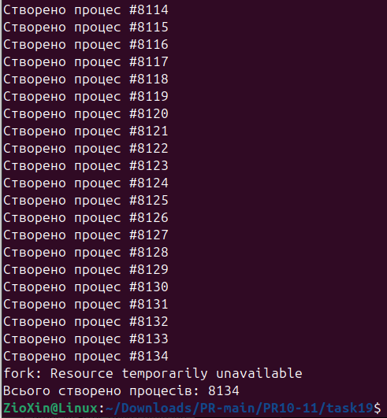

# ЗАВДАННЯ ЗА ВАРІАНТОМ

## Умова

Створіть цикл, у якому викликається fork(), поки це можливо. Визначте, скільки процесів вдалося створити до помилки.

## Опис програми

Програма реалізована у вигляді нескінченного циклу (while (1)), в якому виконується системний виклик fork().

* **Батьківський процес**: Після кожного успішного створення дочірнього процесу він збільшує лічильник та виводить повідомлення про це.
* **Дочірній процес**: Щоб уникнути експоненційного росту ("форк-бомби"), кожен новостворений дочірній процес негайно завершує свою роботу за допомогою _exit(0).

Цикл продовжується доти, доки виклик fork() не зазнає невдачі, що найчастіше відбувається через досягнення системного ліміту на кількість процесів. Після цього програма виводить повідомлення про помилку та загальну кількість успішно створених процесів.

## [Код до завдання](task19/task.c)

---
