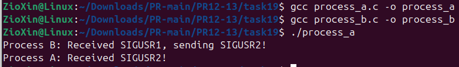

# ЗАВДАННЯ ЗА ВАРІАНТОМ

## Умова

Реалізуйте модель обміну між двома процесами, де один надсилає сигнал SIGUSR1 з таймаутом, а інший повинен відповісти SIGUSR2 — що буде, якщо обидва сигнали приходять одночасно?

## Опис програми

Ця програмна реалізація моделює двосторонній обмін сигналами між батьківським (Процес А) та дочірнім (Процес B) процесами.

Реалізація демонструє послідовний ланцюжок "запит-відповідь":
* **Процес А** створює Процес B за допомогою fork() та execl.
* Після паузи Процес А надсилає сигнал SIGUSR1 дочірньому процесу.
* **Процес B**, отримавши SIGUSR1, у своєму обробнику відправляє у відповідь сигнал SIGUSR2 батьківському процесу.
* **Процес А** отримує SIGUSR2, і його обробник виводить фінальне повідомлення.

## [Код до завдання](task19/task.c)

---
