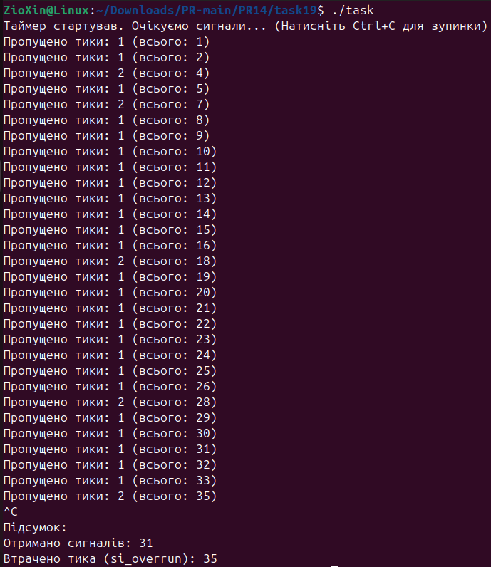

# ЗАВДАННЯ ЗА ВАРІАНТОМ

## Умова

Побудуйте систему, яка фіксує втрати тика таймера через переповнення сигналів (SIGEV_SIGNAL) при навантаженні.

## Опис програми

Ця програма демонструє механізм виявлення втрачених сигналів від POSIX-таймера при високому навантаженні.
Програмна реалізація

Програма створює високочастотний POSIX-таймер (timer_create), який кожні 10 мілісекунд посилає процесу сигнал реального часу SIGRTMIN.

Обробник сигналів (timer_handler), зареєстрований з прапором SA_SIGINFO, штучно уповільнений викликом usleep на 20 мілісекунд. Оскільки обробник працює довше за інтервал таймера, система не встигає доставити всі сигнали, і вони починають накопичуватися.

Втрата сигналів фіксується всередині обробника шляхом зчитування поля si->si_overrun у структурі siginfo_t. Це поле містить кількість спрацьовувань таймера, що сталися, але для яких сигнал не був доставлений. Програма виводить цю інформацію в консоль і підсумовує загальну кількість отриманих та втрачених сигналів при завершенні роботи через Ctrl+C.

## [Код до завдання](task19/task.c)

---
