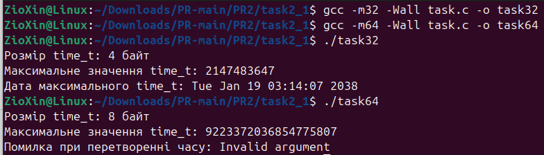
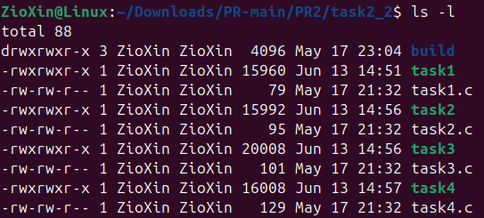
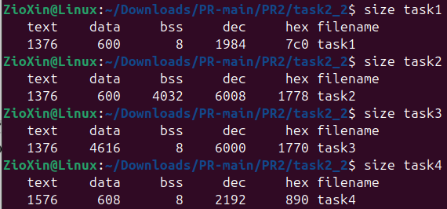
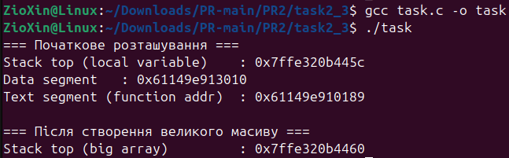
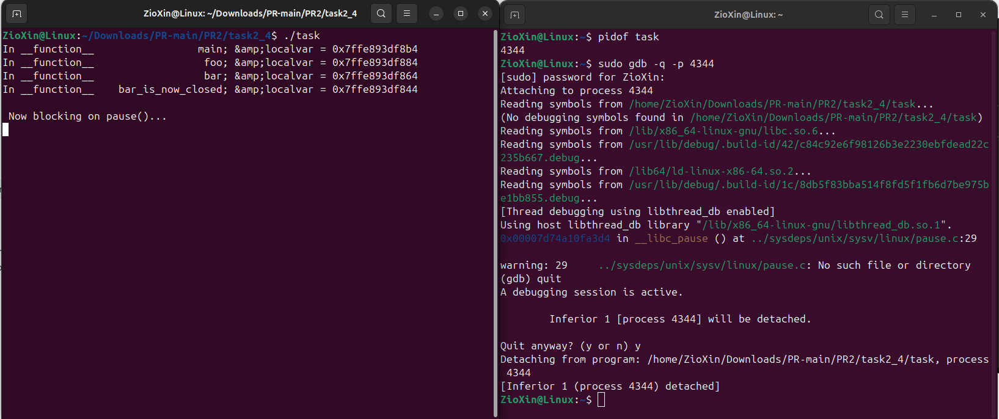
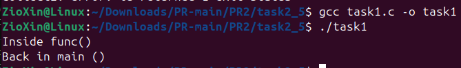
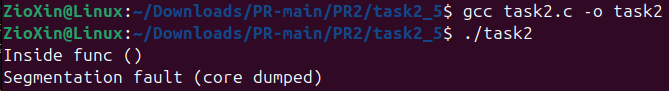
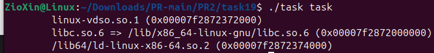

# ЗАВДАННЯ 1

## Умова

Напишіть програму для визначення моменту, коли time_t закінчиться.Дослідіть, які зміни відбуваються в залежності від 32- та 64-бітної архітектури. Дослідіть сегменти виконуваного файлу.

## Опис програми

Ця програма досліджує тип даних time_t, який використовується для представлення часу в системах Unix. Вона визначає розмір time_t (у байтах) та його максимальне можливе значення для поточної архітектури (32- або 64-бітної). Далі програма намагається перетворити максимальне значення time_t у читабельний формат дати за допомогою функції ctime().  

**Ключові висновки:**  
- На **32-бітній** архітектурі time_t зазвичай має розмір **4 байти**, а його максимальне значення відповідає **19 січня 2038 року**.  
- На **64-бітній** архітектурі time_t займає **8 байт**, і його максимальне значення настільки велике, що перевищує можливості функції 'ctime()', що призводить до помилки.  

Програма також демонструє, як архітектура системи впливає на представлення часу, і підкреслює важливість використання 64-бітних систем для уникнення обмежень, пов’язаних із 2038 роком.

## [Код до завдання](task2_1/task.c)

---

# ЗАВДАННЯ 2

## Умова

Розгляньте сегменти у виконуваному файлі.
1. Скомпілюйте програму 'hello world', запустіть ls -l для виконуваного файлу, щоб отримати його загальний розмір, і запустіть size, щоб отримати розміри сегментів всередині нього.
2. Додайте оголошення глобального масиву із 1000 int, перекомпілюйте й повторіть вимірювання. Зверніть увагу на відмінності.
3. Тепер додайте початкове значення в оголошення масиву (пам’ятайте, що C не змушує вас вказувати значення для кожного елемента масиву в ініціалізаторі). Це перемістить масив із сегмента BSS у сегмент даних. Повторіть вимірювання. Зверніть увагу на різницю.
4. Тепер додайте оголошення великого масиву в локальну функцію. Оголосіть другий великий локальний масив з ініціалізатором. Повторіть вимірювання. Дані розташовуються всередині функцій, залишаючись у виконуваному файлі? Яка різниця, якщо масив ініціалізований чи ні?
5. Які зміни відбуваються з розмірами файлів і сегментів, якщо ви компілюєте для налагодження? Для максимальної оптимізації?
**Проаналізуйте результати, щоб переконатися, що:**
- сегмент даних зберігається у виконуваному файлі;
- сегмент BSS не зберігається у виконуваному файлі (за винятком примітки щодо його вимог до розміру часу виконання);
- текстовий сегмент більшою мірою піддається перевіркам оптимізації;
- на розмір файлу a.out впливає компіляція для налагодження, але не сегменти.

## Опис програми
1. **Базовий випадок (task1.c):**  
   - Мінімальний розмір text (код), невеликі data та bss.  
   - Загальний розмір файлу: 15 960 байт.  

2. **Глобальний неініціалізований масив (task2.c):**  
   - Масив розміщується у сегменті bss (не займає місця у файлі, але вимагає пам’яті під час виконання).  
   - bss зростає до 4032 байт.  
   - Загальний розмір файлу залишається майже незмінним.  

3. **Глобальний ініціалізований масив (task3.c):**  
   - Масив переміщується до data (зберігається у файлі).  
   - data зростає до 4616 байт, bss скорочується.  
   - Загальний розмір файлу збільшується (20 008 байт).  

4. **Локальні масиви (task4.c):**  
   - Локальні масиви (ініціалізований та ні) не впливають на розмір виконуваного файлу, оскільки виділяються на стеку під час виконання.  
   - Незначне зростання text через додатковий код ініціалізації.  

### Висновки:  
- **Сегмент data** зберігається у файлі, тому ініціалізовані дані збільшують його розмір.  
- **Сегмент bss** не займає місця у файлі (лише вказує розмір для виділення пам’яті під час запуску).  
- **Текстовий сегмент (text)** змінюється при додаванні коду (наприклад, ініціалізації), але оптимізація може його скоротити.  
- Налагоджувальні збірки збільшують розмір файлу через додаткову інформацію, але не впливають на data/bss.
## [Код до завдання(task1.c)](task2_2/task1.c)
## [Код до завдання(task2.c)](task2_2/task2.c)
## [Код до завдання(task3.c)](task2_2/task3.c)
## [Код до завдання(task4.c)](task2_2/task4.c)

---

# ЗАВДАННЯ 3

## Умова

Скомпілюйте й запустіть тестову програму, щоб визначити приблизне розташування стека у вашій системі:
#include &lt;stdio.h&gt;

int main() {

int i;

printf(&quot;The stack top is near %p\n&quot;, &amp;i);

return 0;

}

Знайдіть розташування сегментів даних і тексту, а також купи всередині сегмента даних, оголосіть змінні, які будуть поміщені в ці сегменти, і виведіть їхні адреси.
Збільшіть розмір стека, викликавши функцію й оголосивши кілька великих локальних масивів. Яка зараз адреса вершини стека?

Примітка: стек може розташовуватися за різними адресами на різних архітектурах та різних ОС. Хоча ми говоримо про вершину стека, на більшості процесорів стек зростає вниз, до пам’яті з меншими значеннями адрес.

## Опис програми

Ця програма демонструє розташування основних сегментів пам'яті процесу.

Спочатку програма визначає та виводить адреси трьох ключових областей:

* **Сегмент коду (Text Segment):** Адреса функції dummy_function, де зберігається виконуваний код.
* **Сегмент даних (Data Segment):** Адреса глобальної змінної global_v, яка ініціалізована і зберігається в цьому сегменті.
* **Стек (Stack):** Початкова адреса локальної змінної local_var, що вказує на поточне положення вершини стека.

Далі, для демонстрації розширення стека, програма оголошує великий локальний масив big_stack_array розміром 1 МБ. Оскільки локальні змінні розміщуються на стеку, це призводить до значного зсуву його вершини. Програма виводить адресу цього нового масиву, ілюструючи, як виділення великого об'єкта на стеку змінює його заповнення.

## [Код до завдання](task2_3/task.c)

---

# ЗАВДАННЯ 4

## Умова

Ваше завдання – дослідити стек процесу або пригадати, як це робиться. Ви можете:
- Автоматично за допомогою утиліти gstack.
- Вручну за допомогою налагоджувача GDB.

Користувачі Ubuntu можуть зіткнутися з проблемою: на момент написання (Ubuntu 18.04) gstack, схоже, не був доступний (альтернативою може бути pstack). Якщо gstack не працює, використовуйте другий метод – через GDB, як показано нижче.

## Опис програми

Програма демонструє вкладені виклики функцій із передачею керування через main(), foo(), bar() та bar_is_now_closed() і подальше блокування на системному виклику pause(). Кожна функція виводить адресу своєї локальної змінної, дозволяючи відстежувати зміни в стеку. Завдання передбачає дослідження стеку процесу за допомогою інструментів procstat та GDB для порівняння їхньої функціональності.

## [Код до завдання](task2_4/task.c)

---

# ЗАВДАННЯ 4

## Умова

Відомо, що при виклику процедур і поверненні з них процесор
використовує стек.Чи можна в такій схемі обійтися без лічильника команд
(IP), використовуючи замість нього вершину стека? Обґрунтуйте свою
відповідь та наведіть приклади.

## [Код до завдання(task1.c)](task2_5/task1.c)
## [Код до завдання(task2.c)](task2_5/task2.c)

---

# ЗАВДАННЯ ЗА ВАРІАНТОМ

## Умова

Напишіть програму для перевірки залежностей ELF-файлів.

## Опис програми

Ця програма є обгорткою для утиліти ldd. Вона приймає шлях до ELF-файлу як аргумент командного рядка, формує команду ldd <шлях_до_файлу> і виконує її через системний виклик system(). В результаті на екран виводиться список динамічних залежностей цього файлу.

## [Код до завдання](task19/task.c)

---
