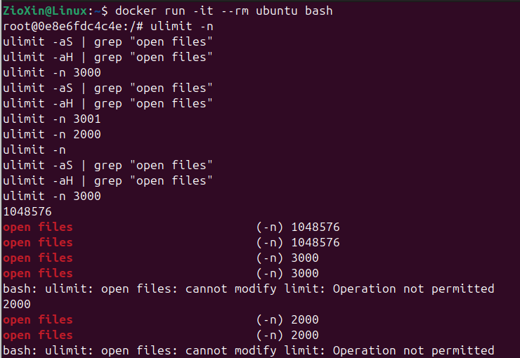
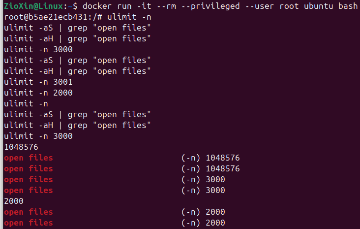
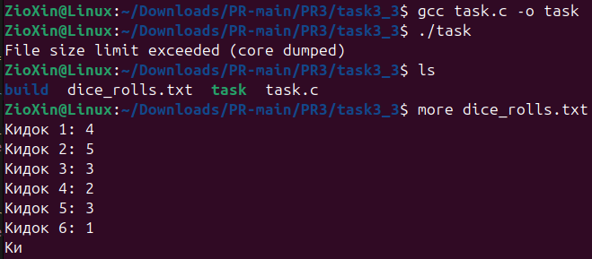
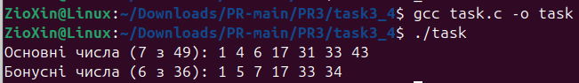
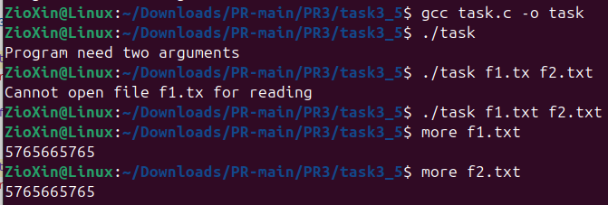
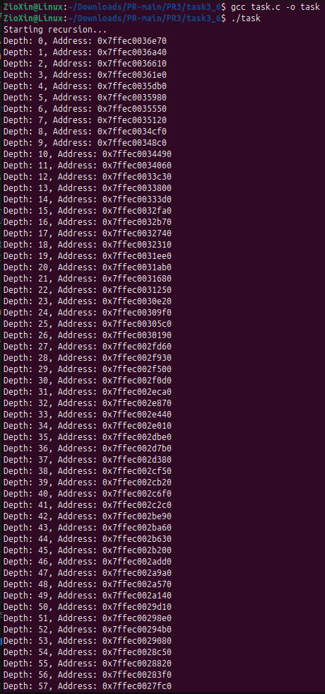
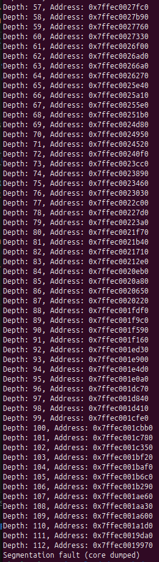
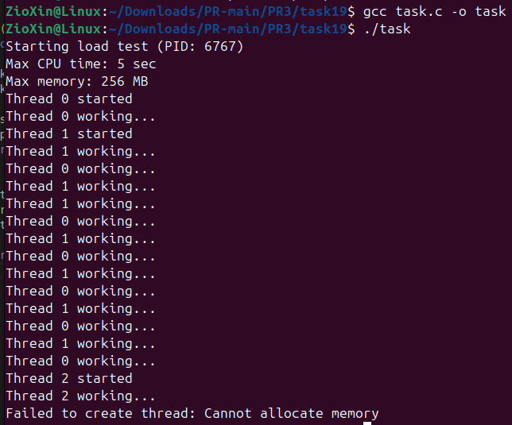

# ЗАВДАННЯ 1

## Умова

Запустіть Docker-контейнер і поекспериментуйте з максимальним лімітом ресурсів відкритих файлів. Для цього виконайте команди у вказаному порядку:
$ ulimit -n

$ ulimit -aS | grep "open files"

$ ulimit -aH | grep "open files"

$ ulimit -n 3000

$ ulimit -aS | grep "open files"

$ ulimit -aH | grep "open files"

$ ulimit -n 3001

$ ulimit -n 2000

$ ulimit -n

$ ulimit -aS | grep "open files"

$ ulimit -aH | grep "open files"

$ ulimit -n 3000

Як наступне вправу, повторіть перераховані команди з root-правами.

## Опис програми

На основі проведених експериментів, ключова відмінність полягає у правах на зміну лімітів:

* **Стандартний контейнер:** Дозволяє користувачу root лише **знижувати** "м'який" ліміт ресурсів. Спроба підвищити його після зниження блокується з помилкою "Operation not permitted".
* **Привілейований контейнер (--privileged):** Надає користувачу root можливість як знижувати, так і підвищувати "м'який" ліміт ресурсів у межах "жорсткого" ліміту.

Таким чином, прапор --privileged надає root-користувачу в контейнері розширені права (capabilities`), яких немає у стандартному режимі, дозволяючи вільніше керувати лімітами.

---

# ЗАВДАННЯ 2

## Умова

У Docker-контейнері встановіть утиліту perf(1). Поекспериментуйте з досягненням процесом встановленого ліміту.

---

# ЗАВДАННЯ 3

## Умова

Напишіть програму, що імітує кидання шестигранного кубика. Імітуйте кидки, результати записуйте у файл, для якого попередньо встановлено обмеження на його максимальний розмір (max file size). Коректно обробіть ситуацію перевищення ліміту.

## Опис програми

Ця програма імітує кидання кубика, записуючи результати у файл, для якого попередньо встановлено ліміт на розмір у 100 байт за допомогою setrlimit.

Програма працює в циклі, записуючи результати, доки не перевищить ліміт. Після цього її виконання припиняється операційною системою з помилкою "File size limit exceeded". Створений файл dice_rolls.txt залишається неповним, що підтверджує спрацювання обмеження.

## [Код до завдання](task3_3/task.c)

---

# ЗАВДАННЯ 4

## Умова

Напишіть програму, що імітує лотерею, вибираючи 7 різних цілих чисел у діапазоні від 1 до 49 і ще 6 з 36. Встановіть обмеження на час ЦП (max CPU time) і генеруйте результати вибору чисел (7 із 49, 6 із 36). Обробіть ситуацію, коли ліміт ресурсу вичерпано.

## Опис програми

Ця програма імітує лотерею (7 з 49 і 6 з 36), встановлюючи 2-секундний ліміт часу виконання за допомогою alarm та обробника сигналу SIGALRM.

Вона генерує унікальні числа для двох розіграшів, сортує їх і виводить на екран. Оскільки вся робота виконується швидше, ніж за 2 секунди, ліміт часу не спрацьовує, і програма успішно завершується без попереджень.

## [Код до завдання](task3_4/task.c)

---

# ЗАВДАННЯ 5

## Умова

Напишіть програму для копіювання одного іменованого файлу в інший. Імена файлів передаються у вигляді аргументів.

Програма має:

- перевіряти, чи передано два аргументи, інакше виводити "Program need two arguments";
- перевіряти доступність першого файлу для читання, інакше виводити "Cannot open file .... for reading";
- перевіряти доступність другого файлу для запису, інакше виводити "Cannot open file .... for writing";
- обробляти ситуацію перевищення обмеження на розмір файлу.

## Опис програми

Ця програма копіює файл, використовуючи імена, передані як аргументи командного рядка.  Вона поблочно читає дані з вихідного файлу та записує їх у цільовий.

Ключові особливості реалізації:

- Перевіряється наявність рівно двох аргументів та доступність файлів для читання/запису.
- Під час копіювання відстежується розмір, щоб не перевищити ліміт в 1 ГБ.
- У разі будь-якої помилки частково створений файл видаляється.

## [Код до завдання](task3_5/task.c)

---

# ЗАВДАННЯ 6

## Умова

Напишіть програму, що демонструє використання обмеження (max stack segment size). Підказка: рекурсивна програма активно використовує стек.

## Опис програми

Програма демонструє переповнення стека, встановлюючи на нього ліміт за допомогою setrlimit. Потім вона викликає рекурсивну функцію, яка на кожному кроці виділяє 1024 байти стекової пам'яті, друкуючи глибину занурення.

Програма виконується до глибини рекурсії 112, після чого вичерпує ліміт і завершується з помилкою "Segmentation Fault", що свідчить про успішне спрацювання обмеження.

## [Код до завдання](task3_6/task.c)

---

# ЗАВДАННЯ ЗА ВАРІАНТОМ

## Умова

Створити імітацію серверного навантаження і протестувати обмеження.

## Опис програми

Програма використовує функцію setrlimit, щоб встановити для себе жорсткі ліміти:

-Час процесора (RLIMIT_CPU): не більше 5 секунд.

-Віртуальна пам'ять (RLIMIT_AS): не більше 256 МБ.

Після цього програма намагається в циклі створити 100 робочих потоків (pthread_create), кожен з яких виконує інтенсивні обчислення, щоб імітувати навантаження.

Згідно з результатами виконання, програма не може створити всі заплановані потоки. Виклик pthread_create завершується з помилкою "Cannot allocate memory" після створення лише кількох потоків. Це демонструє, що встановлене обмеження пам'яті успішно спрацювало, і операційна система не дозволила процесу вийти за його межі.

## [Код до завдання](task19/task.c)

---
