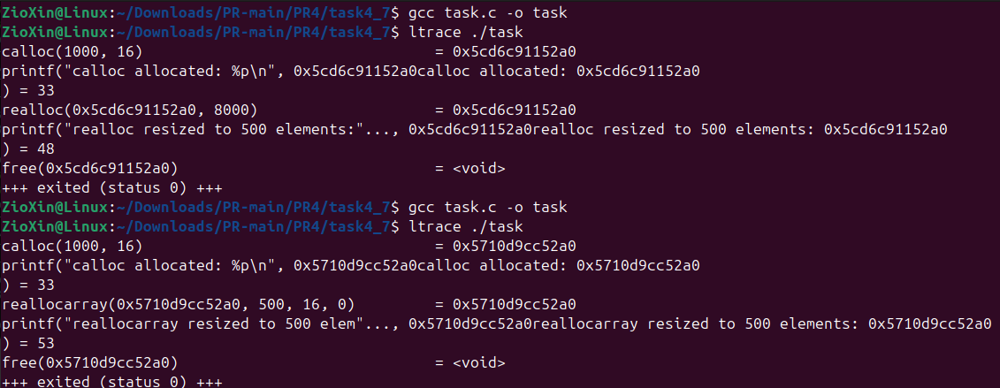

# ЗАВДАННЯ 1

## Умова

Скільки пам’яті може виділити malloc(3) за один виклик?
Параметр malloc(3) є цілим числом типу даних size_t, тому логічно максимальне число, яке можна передати як параметр malloc(3), — це максимальне значення size_t на платформі (sizeof(size_t)). У 64-бітній Linux size_t становить 8 байтів, тобто 8 * 8 = 64 біти. Відповідно, максимальний обсяг пам’яті, який може бути виділений за один виклик malloc(3), дорівнює 2^64. Спробуйте запустити код на x86_64 та x86. Чому теоретично максимальний обсяг складає 8 ексабайт, а не 16?

## Опис програми

Ця програма експериментально перевіряє максимальний обсяг пам'яті, що може бути виділений одним викликом malloc. 

Вона обчислює теоретично можливий максимум для багатьох 64-бітних реалізацій (~8 Ексабайт, або 2^63 - 1 байт) і намагається виділити його.  У випадку невдачі, як показано у виводі, програма повідомляє про помилку та розмір пам'яті, який не вдалося виділити.

## [Код до завдання](task4_1/task.c)

---

# ЗАВДАННЯ 2

## Умова

Що станеться, якщо передати malloc(3) від’ємний аргумент? Напишіть тестовий випадок, який обчислює кількість виділених байтів за формулою num = xa * xb. Що буде, якщо num оголошене як цілочисельна змінна зі знаком, а результат множення призведе до переповнення? Як себе поведе malloc(3)? Запустіть програму на x86_64 і x86.

## Опис програми

Ця програма демонструє, що відбувається при передачі malloc від'ємного значення, отриманого в результаті множення цілих чисел. 

Ключовий ефект полягає в тому, що від'ємне число типу int при перетворенні на беззнаковий size_t стає величезним додатним числом.  В результаті malloc не може виконати нереалістично великий запит на виділення пам'яті і завершується з помилкою "Cannot allocate memory".

## [Код до завдання](task4_2/task.c)

---

# ЗАВДАННЯ 3

## Умова

Що станеться, якщо використати malloc(0)? Напишіть тестовий випадок, у якому malloc(3) повертає NULL або вказівник, що не є NULL, і який можна передати у free(). Відкомпілюйте та запустіть через ltrace. Поясніть поведінку програми.

## Опис програми

Програма є тестовим випадком, що досліджує поведінку malloc(0).
Вона викликає malloc(0), друкує повернутий вказівник, перевіряє, чи він не є NULL, і якщо так — звільняє його за допомогою free(), повідомляючи про успіх операції. Результати виконання демонструють, що на даній системі malloc(0) повертає валідний, не-NULL вказівник, який можна безпечно звільнити.

## [Код до завдання](task4_3/task.c)

---

# ЗАВДАННЯ 4

## Умова

Чи є помилки у такому коді?

void *ptr = NULL;

while (<some-condition-is-true>) {

  if (!ptr)
  
  ptr = malloc(n);
  
  [... <використання 'ptr'> ...]
  
  free(ptr);
  
}

Напишіть тестовий випадок, який продемонструє проблему та правильний варіант коду.

## Опис програми

Програма демонструє та порівнює два підходи до управління пам'яттю в циклі:

Неправильний підхід (incorrect_usage): Пам'ять виділяється (malloc) лише на першій ітерації циклу, але звільняється (free) на кожній. Це призводить до того, що на другій ітерації програма намагається повторно звільнити вже звільнену пам'ять. Результатом є аварійне завершення з помилкою "double free detected". 

Правильний підхід (correct_usage): Пам'ять виділяється один раз перед циклом, використовується протягом усіх ітерацій і звільняється один раз після його завершення. Цей метод працює коректно, що й підтверджується результатами виконання.

## [Код до завдання](task4_4/task.c)

---

# ЗАВДАННЯ 5

## Умова

Що станеться, якщо realloc(3) не зможе виділити пам’ять? Напишіть тестовий випадок, що демонструє цей сценарій.

## Опис програми

Програма демонструє, що відбувається, коли функція realloc не може виділити новий блок пам'яті.

Спочатку програма виділяє невеликий блок пам'яті, а потім намагається змінити його розмір на неможливо великий, щоб гарантовано спровокувати помилку realloc. Коли realloc повертає NULL (ознака помилки), програма перевіряє та демонструє, що вихідний блок пам'яті залишається незмінним, дійсним і доступним для подальших операцій. Наприкінці цей вихідний блок коректно звільняється через free.

Результати виконання підтверджують, що при невдачі realloc вихідний вказівник залишається валідним.

## [Код до завдання](task4_5/task.c)

---

# ЗАВДАННЯ 6

## Умова

Якщо realloc(3) викликати з NULL або розміром 0, що станеться? Напишіть тестовий випадок.

## Опис програми

Програма демонструє поведінку функції realloc у двох специфічних сценаріях:

- Виклик з NULL вказівником (realloc(NULL, 100)): Програма показує, що такий виклик поводиться ідентично до malloc(100), успішно виділяючи новий блок пам'яті.
- Виклик з нульовим розміром (realloc(ptr, 0)): Програма спочатку виділяє пам'ять, а потім викликає для неї realloc з розміром 0. Це демонструє, що такий виклик поводиться ідентично до free(ptr), звільняючи виділену пам'ять і повертаючи NULL.

## [Код до завдання](task4_6/task.c)

---

# ЗАВДАННЯ 7

## Умова

Перепишіть наступний код, використовуючи reallocarray(3):

struct sbar *ptr, *newptr;

ptr = calloc(1000, sizeof(struct sbar));

newptr = realloc(ptr, 500*sizeof(struct sbar));

Порівняйте результати виконання з використанням ltrace.

## Опис програми

Програма порівнює realloc та reallocarray для зміни розміру пам'яті, що аналізується за допомогою ltrace.

ltrace показує, що у випадку з realloc у функцію передається вже обчислений загальний розмір (realloc(ptr, 8000)) , тоді як reallocarray приймає кількість елементів та їх розмір окремо (reallocarray(ptr, 500, 16, 0)). Це демонструє головну перевагу reallocarray: вона безпечно виконує множення всередині, запобігаючи можливим помилкам цілочисельного переповнення.

## [Код до завдання](task4_7/task.c)

---

# ЗАВДАННЯ ЗА ВАРІАНТОМ

## Умова

Напишіть код, що примусово викликає out-of-memory killer у Linux.

## Опис програми

Ця програма викликає out-of-memory killer в Linux, циклічно виділяючи великі блоки пам'яті по 100 МБ за допомогою malloc. Після кожного виділення програма записує дані на кожну сторінку пам'яті, щоб гарантувати її фізичне використання.

Процес продовжується, доки системна пам'ять не вичерпується, після чого ядро примусово завершує програму. Це підтверджується повідомленням "Killed" у виводі після успішного виділення 3000 МБ пам'яті.

## [Код до завдання](task19/task.c)

---
