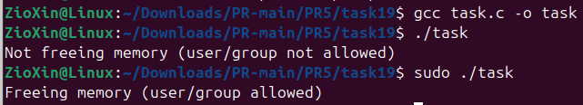

# ЗАВДАННЯ ЗА ВАРІАНТОМ

## Умова

Реалізуйте сценарій, де пам’ять не звільняється лише в разі виклику програми певним користувачем або групою.

## Опис програми

Програма виділяє блок пам'яті за допомогою malloc, а потім викликає функцію should_free_memory(), щоб визначити, чи потрібно цю пам'ять звільняти.
За допомогою функцій getuid, getpwuid та getgrouplist програма отримує ім'я поточного користувача та список усіх груп, до яких він належить. Вона перевіряє, чи є ім'я користувача root або чи входить користувач до групи admin. Якщо будь-яка з умов виконується, функція повертає true, і пам'ять звільняється за допомогою free. В іншому випадку пам'ять навмисно не звільняється, імітуючи витік.

## [Код до завдання](task19/task.c)

---
