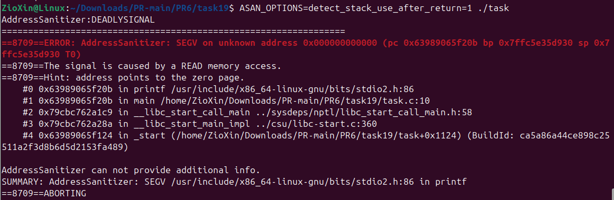

# ЗАВДАННЯ ЗА ВАРІАНТОМ

## Умова

Test Case #9: Use-after-return. Спробуйте запустити ASan з опцією detect_stack_use_after_return=1.

## Опис програми

Проблема полягає в тому, що після завершення роботи get_ptr() її стековий кадр (де знаходилась змінна local) знищується. Вказівник у mainmвказує на вже недійсну область пам'яті. Спроба прочитати дані за цим вказівником призводить до невизначеної поведінки.

ASan, запущений з опцією detect_stack_use_after_return=1, успішно виявляє помилку під час виконання, повідомляючи про нелегальний доступ до пам'яті та аварійно завершуючи програму.

## [Код до завдання](task19/task.c)

---
