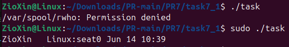
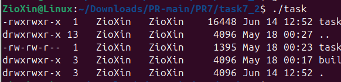
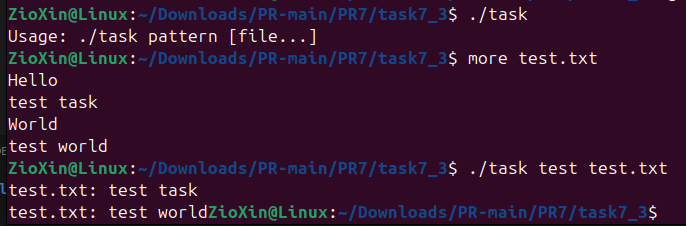
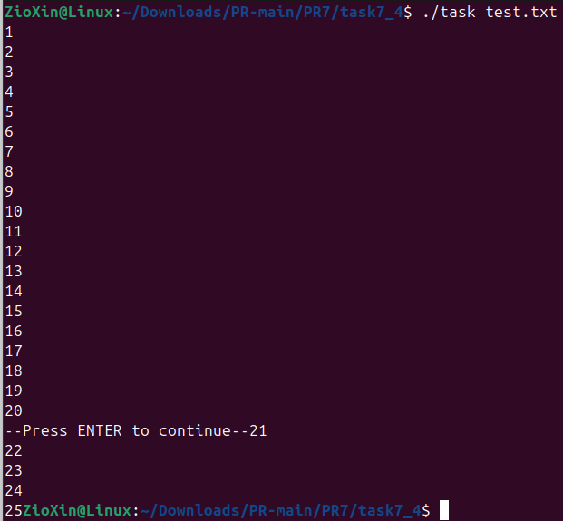
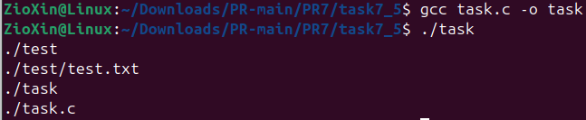
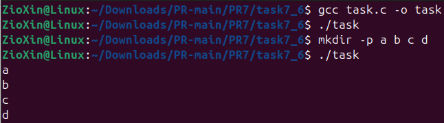
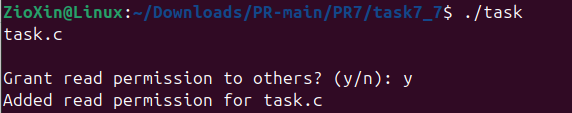
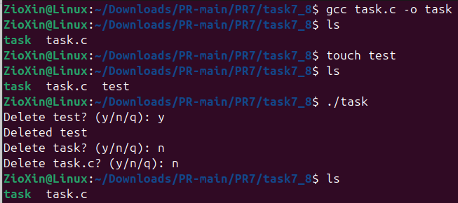
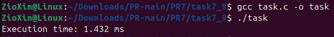
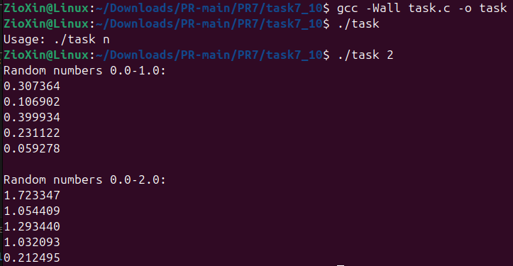

# ЗАВДАННЯ 1

## Умова

Використайте popen(), щоб передати вивід команди rwho (команда UNIX) до more (команда UNIX) у програмі на C.

## Опис програми

Ця програма на C за допомогою popen() виконує команду rwho | more, зчитуючи та виводячи її результат.

Як видно зі скріншота, запуск зазнає невдачі з помилкою "Permission denied", оскільки команді rwho потрібні права адміністратора. Тому виконання програми через sudo проходить успішно.

## [Код до завдання](task7_1/task.c)

---

# ЗАВДАННЯ 2

## Умова

Напишіть програму мовою C, яка імітує команду ls -l в UNIX — виводить список усіх файлів у поточному каталозі та перелічує права доступу тощо.(Варіант вирішення, що просто виконує ls -l із вашої програми, — не підходить.)

## Опис програми

Програма імітує команду ls -l, читаючи поточний каталог за допомогою функцій opendir та readdir. Для кожного файлу вона отримує детальні дані через stat і виводить їх у відформатованому вигляді.

## [Код до завдання](task7_2/task.c)

---

# ЗАВДАННЯ 3

## Умова

Напишіть програму, яка друкує рядки з файлу, що містять слово, передане як аргумент програми (проста версія утиліти grep в UNIX).

## Опис програми

Ця програма є спрощеною версією grep. Вона приймає шаблон для пошуку і один або кілька файлів як аргументи командного рядка.

Програма читає кожен файл рядок за рядком і використовує функцію strstr() для перевірки, чи містить рядок заданий шаблон. Якщо збіг знайдено, вона виводить назву файлу та сам рядок, як це продемонстровано на скріншоті при пошуку слова test у файлі test.txt.

## [Код до завдання](task7_3/task.c)

---

# ЗАВДАННЯ 4

## Умова

Напишіть програму, яка виводить список файлів, заданих у вигляді аргументів, з зупинкою кожні 20 рядків, доки не буде натиснута клавіша (спрощена версія утиліти more в UNIX).

## Опис програми

Ця програма на C імітує утиліту more. Вона приймає імена файлів як аргументи командного рядка і виводить їхній вміст на екран.

Після кожних 20 виведених рядків програма робить паузу. Вона друкує повідомлення --Press ENTER to continue-- і чекає, поки користувач натисне клавішу ENTER, щоб продовжити вивід. Для коректної обробки одиночного натискання клавіші програма змінює налаштування термінала за допомогою функцій tcgetattr та tcsetattr.

## [Код до завдання](task7_4/task.c)

---

# ЗАВДАННЯ 5

## Умова

Напишіть програму, яка перелічує всі файли в поточному каталозі та всі файли в підкаталогах.

## Опис програми

Ця програма рекурсивно виводить список всіх файлів та підкаталогів, починаючи з поточної директорії.

Вона використовує функцію list_files_recursive, яка відкриває каталог (opendir), читає кожен його елемент (readdir), і друкує повний шлях до нього. За допомогою stat та S_ISDIR функція перевіряє, чи є елемент підкаталогом. Якщо так, вона викликає саму себе для цього підкаталогу, продовжуючи обхід вглиб.

## [Код до завдання](task7_5/task.c)

---

# ЗАВДАННЯ 6

## Умова

Напишіть програму, яка перелічує лише підкаталоги у алфавітному порядку.

## Опис програми

Програма на знаходить усі підкаталоги в поточній директорії та виводить їхні імена в алфавітному порядку.

Вона перебирає вміст каталогу (readdir), за допомогою stat та S_ISDIR ідентифікує лише підкаталоги і зберігає їхні імена в масиві. Після завершення сканування, цей масив сортується в алфавітному порядку функцією qsort. Наприкінці програма виводить відсортований список, як це продемонстровано на скріншоті.

## [Код до завдання](task7_6/task.c)

---

# ЗАВДАННЯ 7

## Умова

Напишіть програму, яка показує користувачу всі його/її вихідні програми на C, а потім в інтерактивному режимі запитує, чи потрібно надати іншим дозвіл на читання (read permission); у разі ствердної відповіді — такий дозвіл повинен бути наданий.

## Опис програми

Ця програма на сканує поточний каталог, знаходить усі файли з розширенням .c і виводить їхні імена.

Після цього програма в інтерактивному режимі запитує, чи надати цим файлам дозвіл на читання для інших (Grant read permission to others? (y/n):). Якщо користувач вводить 'y', програма для кожного .c файлу за допомогою stat отримує поточні права, додає прапорець S_IROTH (читання для інших) і застосовує нові права системним викликом chmod.

## [Код до завдання](task7_7/task.c)

---

# ЗАВДАННЯ 8

## Умова

Напишіть програму, яка надає користувачу можливість видалити будь-який або всі файли у поточному робочому каталозі. Має з’являтися ім’я файлу з запитом, чи слід його видалити.

## Опис програми

Ця програма дозволяє інтерактивно видаляти файли з поточного каталогу.

Вона сканує директорію (opendir, readdir) і для кожного файлу (окрім . та ..) виводить його ім'я із запитом на видалення: Delete <ім'я файлу>? (y/n/q):. Якщо користувач відповідає 'y', програма викликає системну функцію unlink для видалення файлу. Введення 'q' достроково завершує роботу програми. Цей процес продемонстровано на скріншоті, де файл 'test' успішно видаляється за згодою користувача.

## [Код до завдання](task7_8/task.c)

---

# ЗАВДАННЯ 9

## Умова

Напишіть програму на C, яка вимірює час виконання фрагмента коду в мілісекундах.

## Опис програми

Ця програма вимірює час виконання фрагмента коду, використовуючи функцію clock_gettime та годинник CLOCK_MONOTONIC для отримання точних показників часу.

Вона фіксує час у структуру timespec до та після виконання циклу. Потім програма обчислює різницю між кінцевим та початковим часом, щоб отримати тривалість виконання в наносекундах. Наприкінці цей результат конвертується в мілісекунди та виводиться на екран, як це показано на скріншоті.

## [Код до завдання](task7_9/task.c)

---

# ЗАВДАННЯ 10

## Умова

Напишіть програму мовою C для створення послідовності випадкових чисел з плаваючою комою у діапазонах:

 (a) від 0.0 до 1.0
 
 (b) від 0.0 до n, де n — будь-яке дійсне число з плаваючою точкою.
 
Початкове значення генератора випадкових чисел має бути встановлене так, щоб гарантувати унікальну послідовність.
Примітка: використання прапорця -Wall під час компіляції є обов’язковим.

## Опис програми

Ця програма генерує випадкові числа з плаваючою комою, приймаючи верхню межу n як аргумент командного рядка.

Для унікальності кожної послідовності, генератор випадкових чисел ініціалізується за допомогою srand та поточного часу. Спочатку програма генерує числа в діапазоні від 0.0 до 1.0, ділячи результат rand() на константу RAND_MAX. Потім вона генерує числа в діапазоні від 0.0 до n, додатково множачи попередній результат на n.

## [Код до завдання](task7_10/task.c)

---

# ЗАВДАННЯ ЗА ВАРІАНТОМ

## Умова

## Опис програми

## [Код до завдання](task19/task.c)

---
