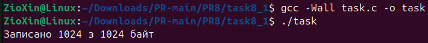
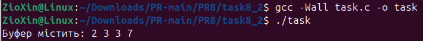
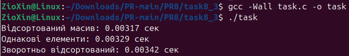
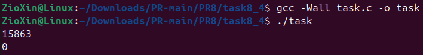
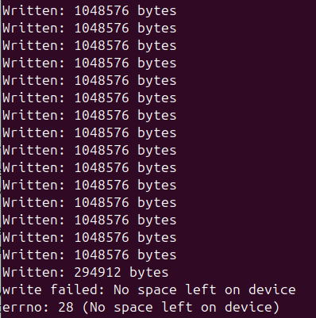

# ЗАВДАННЯ 1

## Умова

Чи може виклик count = write(fd, buffer, nbytes); повернути в змінній count значення, відмінне від nbytes? Якщо так, то чому? Наведіть робочий приклад програми, яка демонструє вашу відповідь.

## Опис програми

Так, write() може повернути менше байтів, ніж було запрошено. Це називається частковим записом.

Основна причина — переривання системним сигналом. Якщо write() не встигає завершити роботу до того, як процес отримає сигнал, він поверне кількість байтів, які встиг записати. Інші причини включають заповнення буферів (для каналів/сокетів) або досягнення ліміту розміру файлу.

У нашій програмі функція ftruncate не обмежує подальший запис, тому write успішно записує всі дані, як видно на скріншоті.

## [Код до завдання](task8_1/task.c)

---

# ЗАВДАННЯ 2

## Умова

Є файл, дескриптор якого — fd. Файл містить таку послідовність байтів: 4, 5, 2, 2, 3, 3, 7, 9, 1, 5. У програмі виконується наступна послідовність системних викликів:

lseek(fd, 3, SEEK_SET);

read(fd, &buffer, 4);

де виклик lseek переміщує покажчик на третій байт файлу. Що буде містити буфер після завершення виклику read? Наведіть робочий приклад програми, яка демонструє вашу відповідь.

## Опис програми

## [Код до завдання](task8_2/task.c)

---

# ЗАВДАННЯ 3

## Умова

Бібліотечна функція qsort призначена для сортування даних будь-якого типу. Для її роботи необхідно підготувати функцію порівняння, яка викликається з qsort кожного разу, коли потрібно порівняти два значення.

Оскільки значення можуть мати будь-який тип, у функцію порівняння передаються два вказівники типу void* на елементи, що порівнюються.

- Напишіть програму, яка досліджує, які вхідні дані є найгіршими для алгоритму швидкого сортування. Спробуйте знайти кілька масивів даних, які змушують qsort працювати якнайповільніше. Автоматизуйте процес експериментування так, щоб підбір і аналіз вхідних даних виконувалися самостійно.

- Придумайте і реалізуйте набір тестів для перевірки правильності функції qsort.

## Опис програми

Програма демонструє такий ланцюжок операцій:

1. Створюється файл data.bin, в який записується початкова послідовність байтів: 4, 5, 2, 2, 3, 3, 7, 9, 1, 5.
2. Виклик lseek(fd, 3, SEEK_SET) переміщує файловий покажчик на початок четвертого байта (з індексом 3). У цьому місці знаходиться значення 2.
3. Виклик read(fd, &buffer, 4) зчитує 4 байти, починаючи з поточної позиції. У буфер потрапляють байти з індексів 3, 4, 5 та 6, що відповідає значенням 2, 3, 3, 7.

## [Код до завдання](task8_3/task.c)

---

# ЗАВДАННЯ 4

## Умова

Виконайте наступну програму на мові програмування С:

int main() {

  int pid;
  
  pid = fork();
  
  printf("%d\n", pid);
  
}

Завершіть цю програму. Припускаючи, що виклик fork() був успішним, яким може бути результат виконання цієї програми?

## Опис програми

Програма виводе два числа: 0 (з дочірнього процесу) та додатній PID (з батьківського процесу), як показано на скріншоті. Порядок їх виведення не гарантований.

Це відбувається тому, що системний виклик fork() в дочірньому процесі повертає 0, а в батьківському — PID дочірнього процесу.

## [Код до завдання](task8_4/task.c)

---

# ЗАВДАННЯ ЗА ВАРІАНТОМ

## Умова

Дослідіть, як працює write() у ситуації нестачі дискового простору, і зафіксуйте поведінку змінної errno.

## Опис програми

Програма заповнює диск, записуючи дані в циклі. Як видно на скріншоті, коли місце на пристрої закінчується, системний виклик write() зазнає невдачі, і:

- Він повертає значення -1.
- Змінна errno встановлюється у значення 28, що відповідає помилці ENOSPC («No space left on device»).

## [Код до завдання](task19/task.c)

---
