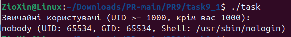
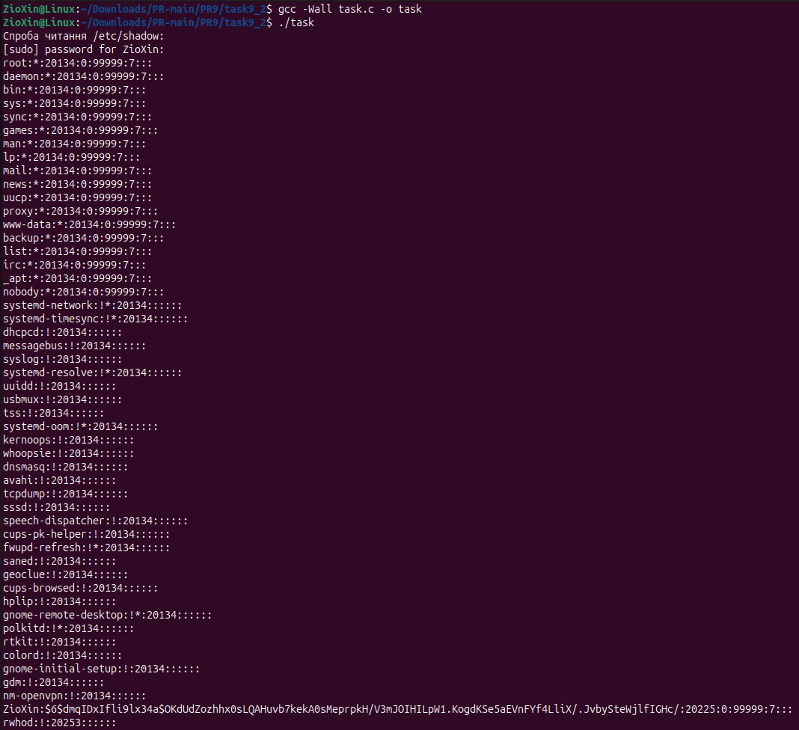
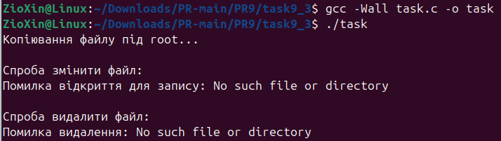
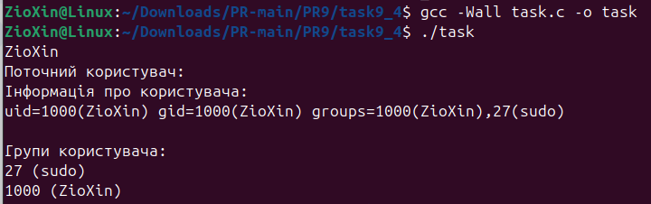
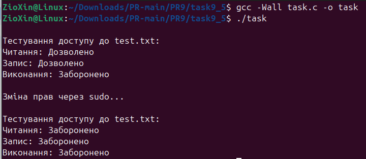
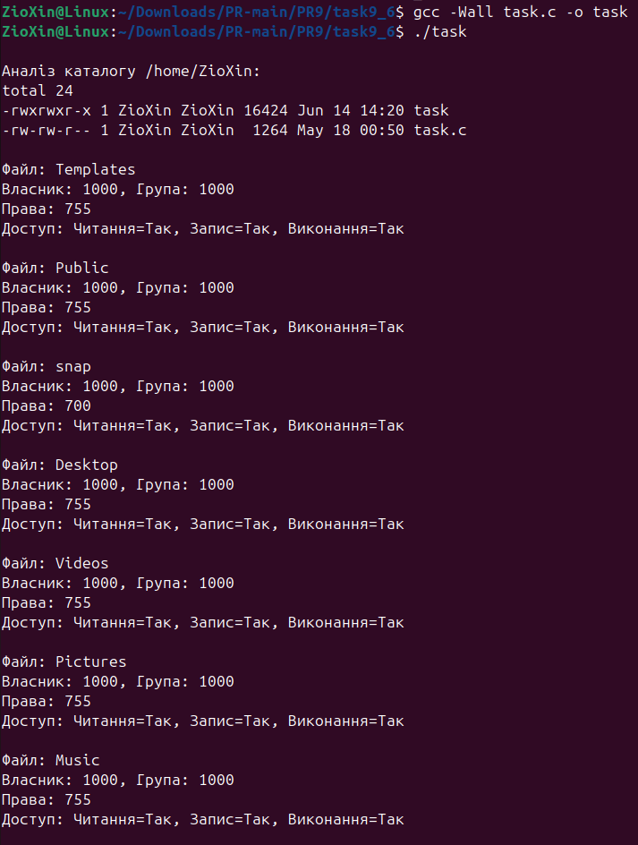
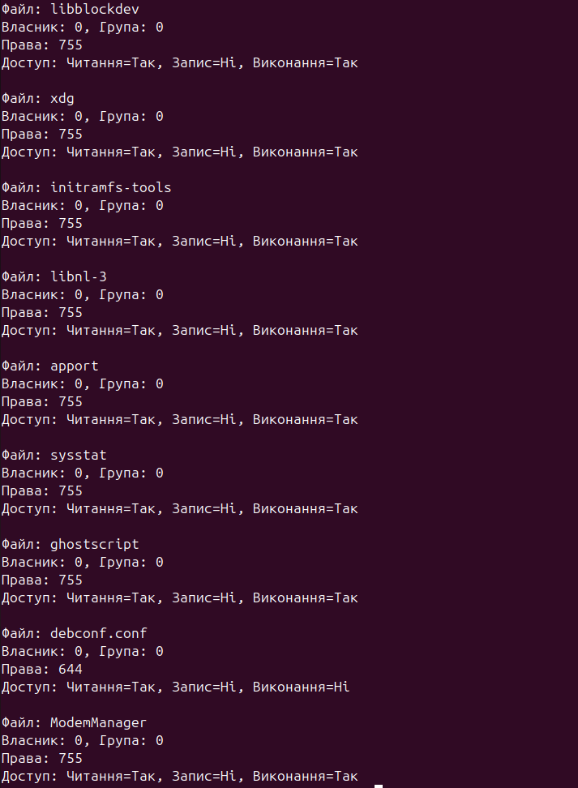
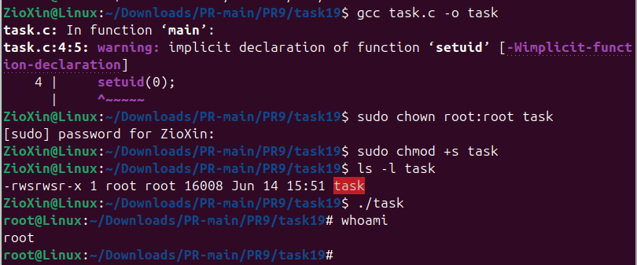

# ЗАВДАННЯ 1

## Умова

Напишіть програму, яка читає файл /etc/passwd за допомогою команди getent passwd, щоб дізнатись, які облікові записи визначені на вашому комп’ютері.

Програма повинна визначити, чи є серед них звичайні користувачі (ідентифікатори UID повинні бути більші за 500 або 1000, залежно від вашого дистрибутива), окрім вас.

## Опис програми

Програма зчитує всі облікові записи користувачів системи за допомогою getpwent().

У циклі вона відфільтровує та виводить лише тих користувачів, чий UID більший або рівний 1000 і не збігається з UID-ом поточного користувача (getuid()). Скріншот демонструє, як програма знаходить одного такого користувача — nobody.

## [Код до завдання](task9_1/task.c)

---

# ЗАВДАННЯ 2

## Умова

Напишіть програму, яка виконує команду cat /etc/shadow від імені адміністратора, хоча запускається від звичайного користувача.(Ваша програма повинна робити необхідне, виходячи з того, що конфігурація системи дозволяє отримувати адміністративний доступ за допомогою відповідної команди.)

## Опис програми

Програма використовує функцію system() для виконання команди "sudo cat /etc/shadow".

Це делегує підвищення прав системній утиліті sudo, яка запитує пароль користувача, як видно на скріншоті. Після успішної аутентифікації команда виконується з правами root, і вміст захищеного файлу /etc/shadow виводиться на екран.

## [Код до завдання](task9_2/task.c)

---

# ЗАВДАННЯ 3

## Умова

Напишіть програму, яка від імені root копіює файл, який вона перед цим створила від імені звичайного користувача. Потім вона повинна помістити копію у домашній каталог звичайного користувача.

Далі, використовуючи звичайний обліковий запис, програма намагається змінити файл і зберегти зміни. Що відбудеться?

Після цього програма намагається видалити цей файл за допомогою команди rm. Що відбудеться?

## Опис програми

Програма створює файл, а потім за допомогою system("sudo ...") робить його копію, власником якої є root.

Як видно на скріншоті, подальші спроби змінити (fopen) та видалити (remove) цю копію зазнають невдачі з помилкою No such file or directory.

Це відбувається тому, що стандартні функції C не розгортають символ тильди (~) у шляху до файлу, тому програма просто не може знайти копію. Навіть якби шлях був правильним, операції все одно провалилися б, але вже з помилкою Permission denied через права власності root.

## [Код до завдання](task9_3/task.c)

---

# ЗАВДАННЯ 4

## Умова

Напишіть програму, яка по черзі виконує команди whoami та id, щоб перевірити стан облікового запису користувача, від імені якого вона запущена.

Є ймовірність, що команда id виведе список різних груп, до яких ви належите. Програма повинна це продемонструвати.

## Опис програми

Програма показує дані про користувача двома способами. Спочатку вона використовує system() для запуску команд whoami та id.

Потім, для демонстрації груп, вона програмно отримує їх список за допомогою функцій getgroups() та getgrgid() і виводить на екран. Скріншот підтверджує, що обидва підходи показують належність користувача до груп ZioXin та sudo.

## [Код до завдання](task9_4/task.c)

---

# ЗАВДАННЯ 5

## Умова

Напишіть програму, яка створює тимчасовий файл від імені звичайного користувача. Потім від імені суперкористувача використовує команди chown і chmod, щоб змінити тип володіння та права доступу.

Програма повинна визначити, в яких випадках вона може виконувати читання та запис файлу, використовуючи свій обліковий запис.

## Опис програми

Програма спершу створює файл test.txt. Перевірка функцією access() підтверджує, що поточний користувач, як власник, має права на читання та запис.

Потім програма за допомогою system("sudo ...") змінює власника файлу на root та права доступу на 600 (читання/запис лише для власника).

Як видно на скріншоті, повторна перевірка access() показує, що доступ для початкового користувача тепер заборонено, оскільки він більше не є власником файлу, а права для інших відсутні.

## [Код до завдання](task9_5/task.c)

---

# ЗАВДАННЯ 6

## Умова

Напишіть програму, яка виконує команду ls -l, щоб переглянути власника і права доступу до файлів у своєму домашньому каталозі, в /usr/bin та в /etc.

Продемонструйте, як ваша програма намагається обійти різні власники та права доступу користувачів, а також здійснює спроби читання, запису та виконання цих файлів.

## Опис програми

Програма аналізує файли у домашньому каталозі, /usr/bin та /etc. Для кожного файлу вона використовує:
* stat(), щоб отримати та показати власника і права доступу.
* access(), щоб перевірити, чи може поточний користувач насправді читати, записувати та виконувати цей файл.

Демонстрація полягає в тому, що у своєму каталозі користувач має доступ на запис до файлів, а в системних каталогах, де файли належать root, доступ на запис для нього **заборонений**, що підтверджують скріншоти.

## [Код до завдання](task9_6/task.c)

---

# ЗАВДАННЯ ЗА ВАРІАНТОМ

## Умова

Чи можна виконати команду як root без використання sudo або su? Шукайте нестандартні підходи.

## Опис програми

1. Підготовка (адміністратором): Створюється програма, що викликає setuid(0) для отримання прав root. Її власником встановлюється root (chown), а на сам файл встановлюється setuid біт (chmod +s).
2. Виконання (користувачем): Звичайний користувач запускає цю програму. Завдяки setuid біту, вона виконується з правами свого власника (root), надаючи користувачу оболонку з підвищеними привілеями, що підтверджує команда whoami на скріншоті.

## [Код до завдання](task19/task.c)

---
